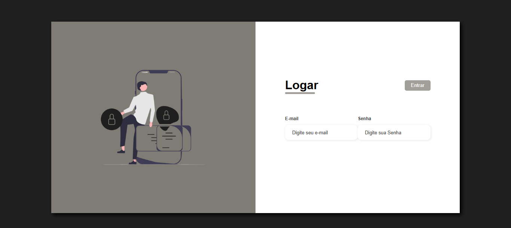
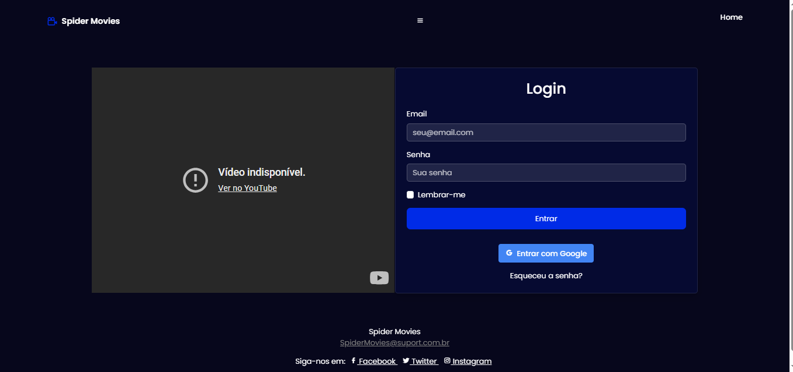

# Trabalho Prático - Semana 04 e 05

Dessa vez, vamos dar sequência ao projeto iniciado na semana passada. Se você ainda não fez o projeto da semana anterior, fique atento, se programe e procure colocar as atividades em dia. Volte lá, leia tudo e faça sua parte pois essa atividade depende da atividade anterior..

Nessa atividade,vamos evoluir o projeto para que a home-page funcione bem tanto no celular quanto no desktop, entendendo também como é o processo gradativo e colaborativo de desenvolvimento de um software, registrando cada etapa no histórico de commits do repositório do git/GitHub..

**IMPORTANTE:** Você deve trabalhar e alterar apenas arquivos dentro da pasta **`public`**. Deixe todos os demais arquivos e pastas desse repositório inalterados. **PRESTE MUITA ATENÇÃO NISSO.**

## Informações Gerais

- Nome: Carolina Eller Marinho de Paula
- Matricula:878827
- Proposta de projeto escolhida: Catalago de filmes
Breve descrição sobre seu projeto:catálogo de filmes é uma aplicação que permite aos usuários explorar, pesquisar e gerenciar uma coleção de filmes. Através de uma interface intuitiva, os usuários podem visualizar informações detalhadas sobre cada filme, como título, sinopse, elenco, gênero e ano de lançamento. Além disso, o catálogo pode incluir funcionalidades como a possibilidade de adicionar filmes à lista de favoritos, classificar e comentar sobre os filmes assistidos, e até mesmo filtrar por categorias específicas.
- Breve descrição sobre seu projeto: o projeto Spider Movies é um site web de filmes que possui um menu de filmes de lançamentos pagina para login e em breve tera funcionalidade e possibilidade de adicionar filmes aos favoritos

## Print da versão responsiva com CSS puro

<<  COLOQUE A IMAGEM AQUI >>

## Print da versão responsiva com Bootstrap

<<  COLOQUE A IMAGEM AQUI >>

